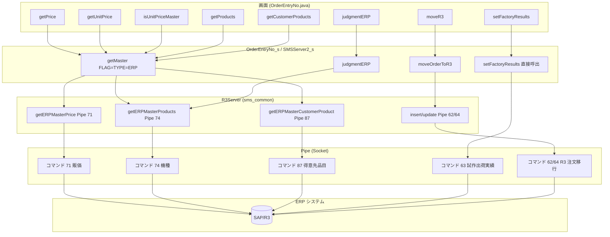
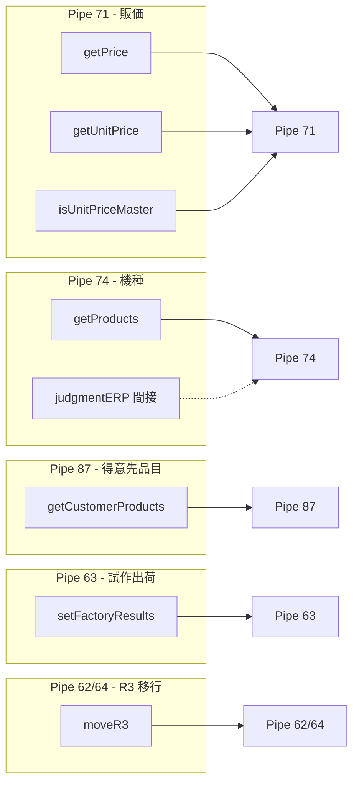
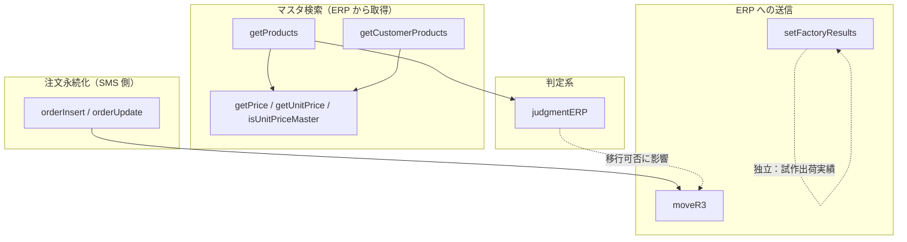

# Sms01206（OrderEntryNo）と ERP 連携インターフェース依赖関係図

本ドキュメントは RMI_SERVER の **Sms01206** サービス（注文入力 OrderEntryNo）について、Sms012C3 と同様に分析する：ERP と連携するインターフェース、依赖関係、ERP 不可用時の業務影響、フロント MOCK および Pipe 反対側 MOCK の可否とリスク。

**サービスとインターフェース**：`OrderEntryNo_i`（インターフェース）、`OrderEntryNo_s`（実装）、画面 `OrderEntryNo.java`。基盤では引き続き `SMSServerIfc`（SMSServer2）の getMaster / moveOrderToR3 / judgmentERP および `sms_common.util.Pipe` により ERP と通信。

---

## 一、全体アーキテクチャ：画面 → API → サーバ → Pipe → ERP

説明：Sms01206 の getConsigns / getCustomers は OrderEntryNo_s で `CUSTOMER_CONSIGN`、`CUSTOMER_LIST_1` を使用しており、一般に SMS マスタ由来で ERP 由来ではない。共通サーバでこれらのタイプも ERP/Pipe 経由にしている場合は、ERP 依存として扱う必要がある。

---

## 二、Pipe コマンド / データタイプ別 API グループ依赖

---

## 三、業務呼び出し順序依赖

---

## 四、Sms01206 と ERP 連携する API 一覧と依赖概要

OrderEntryNo_s で**確認済み**の、FLAG "ERP"・Pipe または moveOrderToR3/judgmentERP により ERP と連携するインターフェースは以下のとおり（Sms012C3 と比較し、getUserList、getCustomerProduct（公開インターフェース）、printEntry、cancelOrder はなし。getConsigns/getCustomers は CUSTOMER_CONSIGN/CUSTOMER_LIST_1 を使用し、本実装では CUSTOMER_LIST_ERP を直接使用していない）。

| API | 方向 | Pipe/タイプ | 依赖関係の概要 |
|-----|------|-------------|----------------|
| getPrice | 取得 | 71 販価 | **まず** getMaster(PRICE) で FLAG なし。**prm に KEY2="ERP" が含まれ、かつ SMS にデータがない場合のみ** getMaster(FLAG "ERP", PRICE) を再呼び出し |
| getUnitPrice | 取得 | 71 販価 | **まず** getMaster(PRICE) で FLAG なし。**prm に KEY2="ERP" または KEY3="ERP" が含まれ、かつ SMS にデータがない場合のみ** FLAG "ERP" を付与 |
| isUnitPriceMaster | 取得 | 71 販価 | **まず** getMaster(PRICE) で FLAG なし。**prm に KEY2="ERP" が含まれ、かつ SMS にデータがない場合のみ** FLAG "ERP" を付与 |
| getProducts | 取得 | 74 機種 | **まず** getMaster(PRODUCT / PRODUCT_LIST_3) で FLAG なし。**prm に KEY1="ERP" が含まれ、かつ SMS 0 件、または検索キー末尾が `'` の場合のみ** FLAG "ERP" を付与 |
| getCustomerProducts | 取得 | SMS マスタ | **getMaster(CUSTOMER_PRODUCT) のみ**。**FLAG "ERP" なし**。ERP にアクセスしない |
| setFactoryResults | 送信 | 63 | 直接 `Pipe(host_, port_).open("63 "...)` |
| moveR3 | 送信 | 62/64 | remoteObject_.moveOrderToR3 を呼び出し。業務上は orderInsert/orderUpdate の先行実行に依存 |
| judgmentERP | 判定 | 間接 74 | remoteObject_.judgmentERP。製品マスタに依存。moveR3 実行可否に影響 |

**説明**：  
- **取得系** 5 個：getPrice, getUnitPrice, isUnitPriceMaster, getProducts, getCustomerProducts。このうち **getCustomerProducts は SMS マスタのみ使用**。残り 4 個は**まず SMS、条件を満たした場合にのみ ERP**（下節参照）。  
- **送信系** 2 個：setFactoryResults（独立）、moveR3（注文保存済みに依存）。  
- **判定系** 1 個：judgmentERP。  
- 将来 OrderEntryNo または共通層で getConsigns/getCustomers を CUSTOMER_LIST_ERP に変更した場合は、両者を「ERP に依存するインターフェース」に含める必要がある。  
- 内部メソッド **getCustomerProduct**（単品目、CUSTOMER_PRODUCT_ERP2 + FLAG "ERP"）は常に ERP 経由。上記 5 つの公開取得系インターフェースには含まない。

---

### 四.1 ソース結論：5 つの取得系インターフェースは ERP なしでも利用可能

**OrderEntryNo_s.java** および画面 **OrderEntryNo出荷依頼表改造.java** のソース確認結果は以下のとおり。

1. **getPrice**（約 435–462 行）  
   - まず `getMaster(hash)`、TYPE=PRICE、**FLAG 未設定**。  
   - `prm.get(KEY2)=="ERP"` **かつ** `s[0]==null`（SMS に当該販価なし）の場合のみ、`hash.put(FLAG,"ERP")` して getMaster を再呼び出し。  
   - 画面側の getPrice 呼び出しでは **KEY2="ERP" を渡していない**。したがって**通常は SMS のみ**。ERP なしでも利用可能。

2. **getUnitPrice**（約 2776–2822 行）  
   - まず getMaster(PRICE) で FLAG なし（KEY3="ERP" のときのみ初回から FLAG 付与）。  
   - `prm.get(KEY2)=="ERP"` かつ `s[0]==null` の場合にのみ FLAG を付けて ERP を呼び出し。  
   - 画面では **試作出荷モード**（`isFactoryNumberUpdate()`）のときのみ getUnitPrice に KEY2="ERP" を渡す（約 10183–10186 行）。**通常受注画面では渡さない**。ERP なしでも利用可能。

3. **isUnitPriceMaster**（約 2850–2889 行）  
   - getUnitPrice と同様：まず SMS。KEY2="ERP" かつ SMS にデータがない場合のみ ERP。  
   - 画面も試作出荷モードのときのみ KEY2="ERP" を渡す（約 10525–10528 行）。**通常モードでは渡さない**。ERP なしでも利用可能。

4. **getProducts**（約 1230–1322 行）  
   - まず getMaster(PRODUCT または PRODUCT_LIST_3）、FLAG 未設定（検索キー末尾が `'` の強制 ERP 分岐を除く）。  
   - `prm.get(KEY1)=="ERP"` **かつ** `vector.size()==0`（SMS 0 件）の場合にのみ、FLAG "ERP" を付けて getMaster を再呼び出し。  
   - 画面では **試作出荷モード**のときのみ KEY1="ERP" を渡す（約 5620–5622 行）。**通常の機種検索では渡さない**。ERP なしでも利用可能。

5. **getCustomerProducts**（約 1132–1182 行）  
   - `getMaster(hash)` のみ。TYPE=**SMSMasterServer.CUSTOMER_PRODUCT**。**FLAG "ERP" や ERP 分岐は一切なし**。  
   - **常に SMS マスタのみ使用**。ERP と無関係。ERP なしでも完全に利用可能。

**結論**：  
- **通常の受注入力**（試作出荷モード以外）では、上記 5 つの取得系インターフェースは**いずれも ERP にリクエストを送らない**（SMS にデータがない場合の補完検索のみだが、画面は ERP フラグを渡していないため ERP 分岐には入らない）。  
- **ERP が完全に利用できない場合**、試作出荷モードに入らず、機種検索キーを `'` で終わらせなければ、この 5 つの取得系インターフェースは**いずれも正常に利用可能**（SMS マスタに依存）。  
- **ERP に強く依存する**のは **setFactoryResults、moveR3、judgmentERP**、および内部メソッド getCustomerProduct（単品目 ERP 検索）。

---

## 五、ERP に依存するインターフェースがすべて ERP と連携できない場合に、Sms01206 で完了できない業務

**setFactoryResults、moveR3、judgmentERP** および（試作出荷モードまたは強制 ERP 検索時に）getPrice/getUnitPrice/isUnitPriceMaster/getProducts が経由する **ERP 分岐**がすべて利用できない場合、以下の業務に影響する。  
**注意**：通常受注モードでは、getPrice / getUnitPrice / isUnitPriceMaster / getProducts / getCustomerProducts は **SMS マスタのみ使用**し、ERP に接続しない。したがって**マスタ検索は ERP なしでも利用可能**（第四節参照）。

### 1. 完全に完了できない業務（送信系）

| 業務 | 依存する ERP インターフェース | 完了できない意味 |
|------|-------------------------------|------------------|
| **R/3 注文移行** | moveR3（Pipe 62/64） | 注文を SMS から ERP に同期できず、R3 側で注文が生成/更新されない。 |
| **無償試作出荷実績登録** | setFactoryResults（Pipe 63） | 試作出荷実績を ERP に書き戻せない。 |

### 2. マスタ・検索系（試作出荷モードまたは強制 ERP 時のみ影響）

| 業務 | 依存する ERP インターフェース | 完了できない意味 |
|------|-------------------------------|------------------|
| **試作出荷時の機種検索** | getProducts（KEY1="ERP" 時 Pipe 74） | 試作出荷モードで SMS 0 件のときに ERP 経由になる。ERP なしでは ERP から機種を補完検索できない。 |
| **試作出荷時の販価・販価存在** | getPrice, getUnitPrice, isUnitPriceMaster（KEY2/KEY3="ERP" 時 Pipe 71） | 同上。試作出荷モードで SMS にデータがない場合にのみ ERP 経由。 |
| **得意先品目** | getCustomerProducts | **本インターフェースは SMS（CUSTOMER_PRODUCT）のみ使用**。ERP と無関係。ERP なしでは影響なし。 |

### 3. 判定・後続フローへの影響

| 業務 | 依存する ERP インターフェース | 完了できない意味 |
|------|-------------------------------|------------------|
| **ERP 連携機種判定** | judgmentERP | 当該機種が ERP と連携するかを正しく判定できず、R3 に移行すべき注文が移行されない、または移行すべきでないものが移行対象と誤判定される。 |

### 4. 引き続き完了できる業務（ERP なし時のマスタ含む）

- **注文の新規・更新・削除・枝番追加**（getEntryNo, getOrderSub, getOrder, orderInsert, orderUpdate, orderDelete）→ 注文は **SMS 側**で正常に保存・保守できる。  
- **画面初期化とラベル表示**（getLabelString）。  
- **通常モードでのマスタ検索**：getConsigns（CUSTOMER_CONSIGN）、getCustomers（CUSTOMER_LIST_1）、**getPrice / getUnitPrice / isUnitPriceMaster / getProducts / getCustomerProducts**（まず SMS、かつ画面で KEY1/KEY2/KEY3="ERP" を渡さない場合）→ いずれも **SMS マスタ**を使用。ERP なしでも利用可能。

つまり：**試作出荷モード以外では、SMS 内の「受注入力・保守」およびマスタ取得は完了可能。「R3 移行」「試作出荷実績の書き戻し」および試作出荷時の ERP 補完検索のみ完了できない。**

### 5. 影響度別まとめ表

| 影響度 | 業務 | 説明 |
|--------|------|------|
| **完全に不可** | R/3 注文移行 | 注文データを ERP に書き込めない。 |
| **完全に不可** | 無償試作出荷実績登録 | 試作実績を ERP に書き戻せない。 |
| **試作出荷時のみ制限** | 試作出荷モードでの機種・販価補完検索 | 画面が KEY1/KEY2="ERP" を渡し、かつ SMS にデータがない場合にのみ ERP 経由。ERP なしでは補完検索できない。 |
| **ロジック異常** | ERP 連携機種判定 → 移行判断 | R3 移行の可否の前提条件が誤る。 |
| **完了可能** | 通常モードでの SMS 内注文増削改査、マスタ検索、画面操作 | 5 つの取得系および getConsigns/getCustomers は SMS マスタで利用可能。ERP と未同期だが業務はブロックされない。 |

---

## 六、Sms01206 の主要業務入口 API（Sms012C3 と同様）

業務はこれらの API を入口とする必要があり、これらが正しく返却/実行されないと、他の API だけでは業務を完了できない：

| 番号 | API | 業務上の役割 |
|------|-----|--------------|
| 1 | getLabelString | 画面初期化。なければ画面/メッセージを正しく表示できない |
| 2 | getEntryNo | 新規・採番。なければ entry_no が得られず、orderInsert が成功しない |
| 3 | getOrderSub | 検索入口。entry_no で枝番一覧を取得。なければ getOrder に進めない |
| 4 | getOrder | 注文読込。なければ orderUpdate/orderDelete を実行できない |
| 5 | orderInsert | 新規・枝番追加の保存 |
| 6 | orderUpdate | 更新保存 |
| 7 | orderDelete | 削除 |

以上 7 個が**主要 API**。ERP に依存する 8 インターフェースは上記フローでマスタ・判定・ERP への送信を提供するが、この 7 つの入口の代替ではない。
