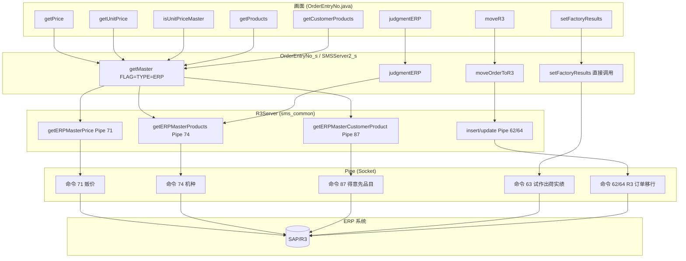
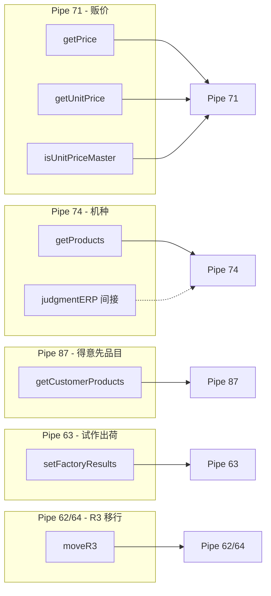
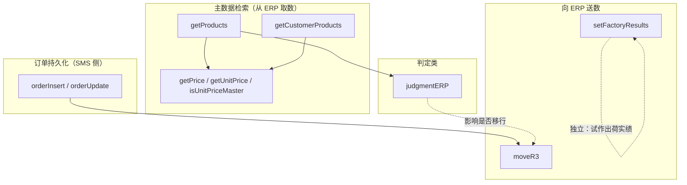

# Sms01206（OrderEntryNo）与 ERP 交互接口依赖关系图

本文档对 RMI_SERVER 的 **Sms01206** 服务（订单录入 OrderEntryNo）进行与 Sms012C3 相同的分析：与 ERP 交互的接口、依赖关系、ERP 不可用时的业务影响、前端 Mock 与 Pipe 另一端 Mock 的可行性及风险。

**服务与接口**：`OrderEntryNo_i`（接口）、`OrderEntryNo_s`（实现）、画面 `OrderEntryNo.java`。底层仍通过 `SMSServerIfc`（如 SMSServer2）的 getMaster / moveOrderToR3 / judgmentERP 及 `sms_common.util.Pipe` 与 ERP 通信。

---

## 一、整体架构：画面 → API → 服务器 → Pipe → ERP

说明：Sms01206 的 getConsigns / getCustomers 在 OrderEntryNo_s 中使用的是 `CUSTOMER_CONSIGN`、`CUSTOMER_LIST_1`，一般来自 SMS 主数据而非 ERP；若共通服务器中这些类型也走 ERP/Pipe，则需一并视为依赖 ERP。

---

## 二、按 Pipe 命令 / 数据类型的 API 分组依赖

---

## 三、业务调用顺序依赖

---

## 四、Sms01206 与 ERP 交互的 API 一览与依赖摘要

OrderEntryNo_s 中**已确认**通过 FLAG "ERP"、Pipe 或 moveOrderToR3/judgmentERP 与 ERP 交互的接口如下（与 Sms012C3 相比，无 getUserList、getCustomerProduct（公开接口）、printEntry、cancelOrder；getConsigns/getCustomers 使用 CUSTOMER_CONSIGN/CUSTOMER_LIST_1，本实现中未直接使用 CUSTOMER_LIST_ERP）。

| API | 方向 | Pipe/类型 | 依赖关系简述 |
|-----|------|-----------|--------------|
| getPrice | 取数 | 71 贩价 | **先** getMaster(PRICE) 无 FLAG；**仅当** prm 含 KEY2="ERP" 且 SMS 无数据时再 getMaster(FLAG "ERP", PRICE) |
| getUnitPrice | 取数 | 71 贩价 | **先** getMaster(PRICE) 无 FLAG；**仅当** prm 含 KEY2="ERP" 或 KEY3="ERP" 且 SMS 无数据时再带 FLAG "ERP" |
| isUnitPriceMaster | 取数 | 71 贩价 | **先** getMaster(PRICE) 无 FLAG；**仅当** prm 含 KEY2="ERP" 且 SMS 无数据时再带 FLAG "ERP" |
| getProducts | 取数 | 74 机种 | **先** getMaster(PRODUCT / PRODUCT_LIST_3) 无 FLAG；**仅当** prm 含 KEY1="ERP" 且 SMS 0 件、或检索键末尾为 `'` 时再带 FLAG "ERP" |
| getCustomerProducts | 取数 | SMS 主数据 | **仅** getMaster(CUSTOMER_PRODUCT)，**无 FLAG "ERP"**，不访问 ERP |
| setFactoryResults | 送数 | 63 | 直接 `Pipe(host_, port_).open("63 "...)` |
| moveR3 | 送数 | 62/64 | 调用 remoteObject_.moveOrderToR3，业务上依赖 orderInsert/orderUpdate 先执行 |
| judgmentERP | 判定 | 间接 74 | remoteObject_.judgmentERP，依赖产品主数据，影响是否走 moveR3 |

**说明**：  
- **取数类** 5 个：getPrice, getUnitPrice, isUnitPriceMaster, getProducts, getCustomerProducts。其中 **getCustomerProducts 仅用 SMS 主数据**；其余 4 个均为 **先 SMS、条件满足时才 ERP**（见下节）。  
- **送数类** 2 个：setFactoryResults（独立）、moveR3（依赖订单已保存）。  
- **判定类** 1 个：judgmentERP。  
- 若将来 OrderEntryNo 或共通层将 getConsigns/getCustomers 改为使用 CUSTOMER_LIST_ERP，则二者也需纳入“依赖 ERP 的接口”。  
- 内部方法 **getCustomerProduct**（单品目，CUSTOMER_PRODUCT_ERP2 + FLAG "ERP"）始终走 ERP，非上述 5 个公开取数接口。

---

### 四.1 源码结论：5 个取数接口在无 ERP 时也可用

对 **OrderEntryNo_s.java** 与画面 **OrderEntryNo出荷依頼表改造.java** 的源码确认如下：

1. **getPrice**（约 435–462 行）  
   - 先 `getMaster(hash)`，TYPE=PRICE，**不设 FLAG**。  
   - 仅当 `prm.get(KEY2)=="ERP"` **且** `s[0]==null`（SMS 无该贩价）时，才 `hash.put(FLAG,"ERP")` 再调 getMaster。  
   - 画面侧调用 getPrice 时**未传入 KEY2="ERP"**，故**通常只走 SMS**，无 ERP 时可用。

2. **getUnitPrice**（约 2776–2822 行）  
   - 先 getMaster(PRICE) 无 FLAG（仅当 KEY3="ERP" 时首次就带 FLAG）。  
   - 仅当 `prm.get(KEY2)=="ERP"` 且 `s[0]==null` 时再带 FLAG 调 ERP。  
   - 画面仅在 **試作出荷モード**（`isFactoryNumberUpdate()`）下对 getUnitPrice 传入 KEY2="ERP"（约 10183–10186 行）。**通常受注画面不传**，无 ERP 时可用。

3. **isUnitPriceMaster**（约 2850–2889 行）  
   - 逻辑同 getUnitPrice：先 SMS，仅当 KEY2="ERP" 且 SMS 无数据时再 ERP。  
   - 画面同样仅在試作出荷モード下传 KEY2="ERP"（约 10525–10528 行）。**通常模式不传**，无 ERP 时可用。

4. **getProducts**（约 1230–1322 行）  
   - 先 getMaster(PRODUCT 或 PRODUCT_LIST_3)，不设 FLAG（除检索键末尾为 `'` 的强制 ERP 分支）。  
   - 仅当 `prm.get(KEY1)=="ERP"` **且** `vector.size()==0`（SMS 0 件）时，再带 FLAG "ERP" 调 getMaster。  
   - 画面仅在 **試作出荷モード** 下传 KEY1="ERP"（约 5620–5622 行）。**通常机种检索不传**，无 ERP 时可用。

5. **getCustomerProducts**（约 1132–1182 行）  
   - 仅 `getMaster(hash)`，TYPE=**SMSMasterServer.CUSTOMER_PRODUCT**，**无任何 FLAG "ERP" 或 ERP 分支**。  
   - **始终只用 SMS 主数据**，与 ERP 无关，无 ERP 时完全可用。

**结论**：  
- **通常受注录入**（非試作出荷モード）下，上述 5 个取数接口**都不会向 ERP 发请求**（或仅用 SMS 无数据时的补查，但画面未传 ERP 标志，故不会进入 ERP 分支）。  
- **ERP 完全不可用时**，只要不进入試作出荷モード、且机种检索键不以 `'` 结尾，这 5 个取数接口**均可正常使用**（依赖 SMS 主数据）。  
- 真正**强依赖 ERP** 的，是 **setFactoryResults、moveR3、judgmentERP**，以及内部方法 getCustomerProduct（单品目 ERP 查询）。

---

## 五、若所有依赖 ERP 的接口均无法与 ERP 交互时，Sms01206 无法完成的业务

当 **setFactoryResults、moveR3、judgmentERP** 以及（在試作出荷モード或强制 ERP 检索时）getPrice/getUnitPrice/isUnitPriceMaster/getProducts 所走的 **ERP 分支** 全部不可用时，以下业务会受影响。  
**注意**：通常受注模式下，getPrice / getUnitPrice / isUnitPriceMaster / getProducts / getCustomerProducts **仅用 SMS 主数据**，不连 ERP，故**主数据检索在无 ERP 时仍可用**（见第四节）。

### 1. 完全无法完成的业务（送数类）

| 业务 | 依赖的 ERP 接口 | 无法完成的含义 |
|------|-----------------|----------------|
| **R/3 订单移行** | moveR3（Pipe 62/64） | 订单无法从 SMS 同步到 ERP，R3 侧不会生成/更新订单。 |
| **无偿试作出荷实绩登録** | setFactoryResults（Pipe 63） | 试作出荷实绩无法回写到 ERP。 |

### 2. 主数据・检索类（仅試作出荷モード或强制 ERP 时受影响）

| 业务 | 依赖的 ERP 接口 | 无法完成的含义 |
|------|-----------------|----------------|
| **試作出荷时的机种检索** | getProducts（KEY1="ERP" 时 Pipe 74） | 試作出荷モード下、SMS 0 件时会走 ERP；无 ERP 则无法从 ERP 补查机种。 |
| **試作出荷时的贩价・贩价存在** | getPrice, getUnitPrice, isUnitPriceMaster（KEY2/KEY3="ERP" 时 Pipe 71） | 同上，仅試作出荷モード下 SMS 无数据时走 ERP。 |
| **得意先品目** | getCustomerProducts | **本接口仅用 SMS（CUSTOMER_PRODUCT）**，与 ERP 无关，无 ERP 时不受影响。 |

### 3. 判定・后续流程受影响

| 业务 | 依赖的 ERP 接口 | 无法完成的含义 |
|------|-----------------|----------------|
| **ERP 连携机种判定** | judgmentERP | 无法正确判定该机种是否与 ERP 连携，导致该移行 R3 的订单可能不移行、或不该移行的被误判为移行。 |

### 4. 仍可完成的业务（含无 ERP 时的主数据）

- **订单的新规・更新・删除・枝番追加**（getEntryNo, getOrderSub, getOrder, orderInsert, orderUpdate, orderDelete）→ 订单在 **SMS 侧** 可正常保存与维护。  
- **画面初始化与标签显示**（getLabelString）。  
- **通常模式下的主数据检索**：getConsigns（CUSTOMER_CONSIGN）、getCustomers（CUSTOMER_LIST_1）、**getPrice / getUnitPrice / isUnitPriceMaster / getProducts / getCustomerProducts**（先 SMS、且画面不传 KEY1/KEY2/KEY3="ERP" 时）→ 均用 **SMS 主数据**，无 ERP 时仍可用。

即：**在非試作出荷モード下，SMS 内的“受注录入・维护”及主数据取得均可完成；仅“R3 移行”“试作出荷实绩回写”以及試作出荷时的 ERP 补查无法完成。**

### 5. 汇总表：按影响程度

| 影响程度 | 业务 | 说明 |
|----------|------|------|
| **完全不可** | R/3 订单移行 | 订单数据无法写入 ERP。 |
| **完全不可** | 无偿试作出荷实绩登録 | 试作实绩无法回写 ERP。 |
| **試作出荷时受限** | 試作出荷モード下的机种・贩价补查 | 仅当画面传 KEY1/KEY2="ERP" 且 SMS 无数据时走 ERP；无 ERP 则无法补查。 |
| **逻辑异常** | ERP 连携机种判定 → 移行判断 | 是否移行 R3 的前提条件错误。 |
| **可完成** | 通常模式下的 SMS 内订单增删改查、主数据检索、画面操作 | 5 个取数接口及 getConsigns/getCustomers 均可用 SMS 主数据，与 ERP 未同步但不阻塞业务。 |

---

## 六、Sms01206 主要业务入口 API（与 Sms012C3 一致）

业务必须以这些 API 为入口，没有它们正确返回/执行，其它 API 无法独立完成业务：

| 序号 | API | 业务角色 |
|------|-----|----------|
| 1 | getLabelString | 画面初始化，无则画面/消息无法正确显示 |
| 2 | getEntryNo | 新规・採番，无则无法得到 entry_no，orderInsert 无法成功 |
| 3 | getOrderSub | 检索入口，按 entry_no 取得枝番列表，无则无法进入 getOrder |
| 4 | getOrder | 加载订单，无则 orderUpdate/orderDelete 无法执行 |
| 5 | orderInsert | 新规・枝番追加保存 |
| 6 | orderUpdate | 更新保存 |
| 7 | orderDelete | 删除 |

以上 7 个为**主要 API**；依赖 ERP 的 8 个接口在上述流程中提供主数据、判定与向 ERP 送数，但不替代这 7 个入口。
