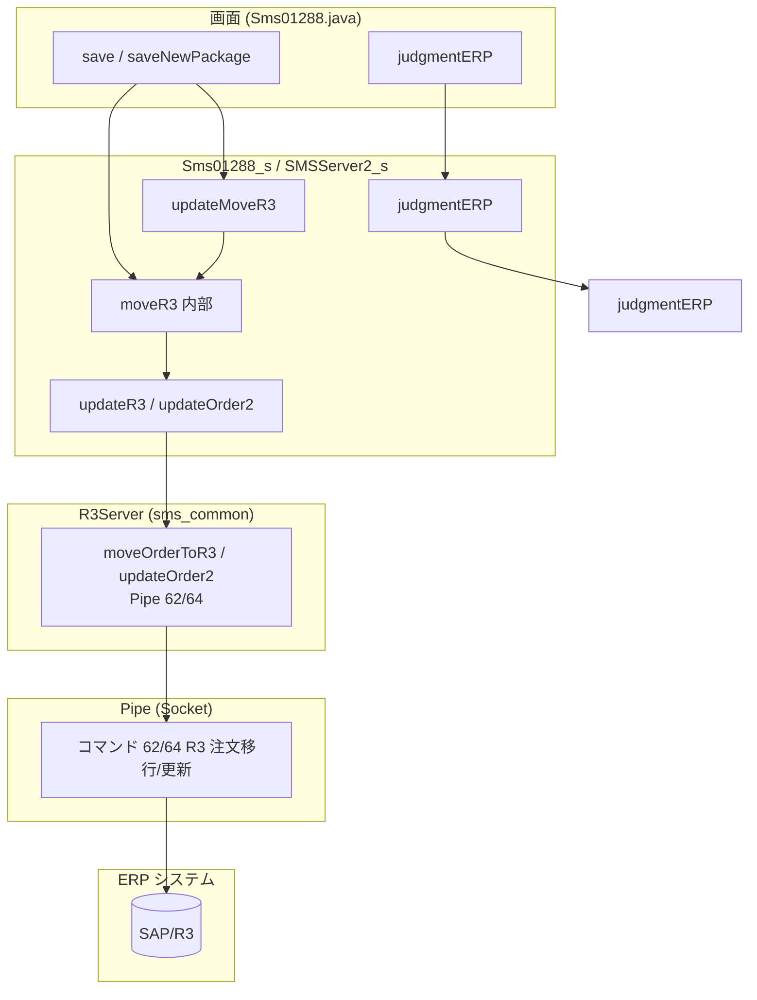
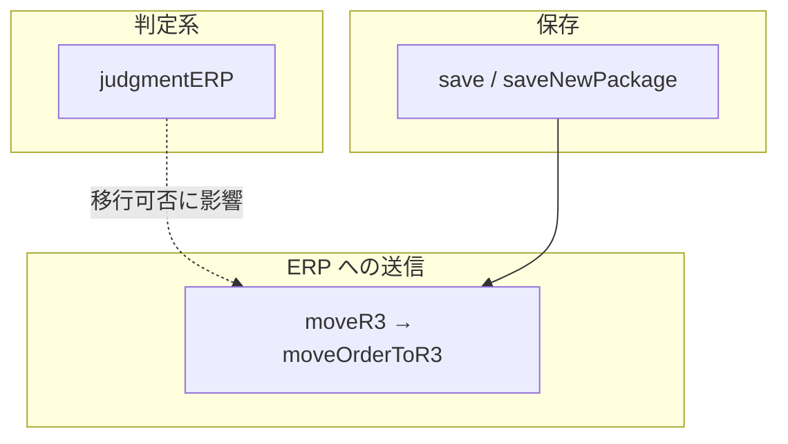

# Sms01288 と ERP 連携インターフェース依赖関係図

本ドキュメントは RMI_SERVER の **Sms01288** サービスについて、Sms012C3 と同様に分析する：ERP と連携するインターフェース、依赖関係、ERP 不可用時の業務影響、フロント MOCK および Pipe 反対側 MOCK の可否とリスク。

**サービスとインターフェース**：`Sms01288_i`（インターフェース）、`Sms01288_s`（実装）、画面 `Sms01288.java`。基盤では `SMSServerIfc`（SMSServer2）の getMaster / moveOrderToR3 / updateOrder2 / judgmentERP により ERP と通信。**Sms01288_s は Pipe クラスを直接使用していない**。setFactoryResults 等の Pipe 63 呼び出しもない。

---

## 一、全体アーキテクチャ：画面 → API → サーバ → R3Server/Pipe → ERP

説明：Sms01288 のマスタ系（getUnitPrice、getProducts、getCustomers、getConsigns 等）の実装では **SMSMasterServer.PRICE、PRODUCT_LIST_1、CUSTOMER_LIST_1、CUSTOMER_CONSIGN、CUSTOMER_PRODUCT** 等のタイプを使用しており、**FLAG "ERP" を明示的に設定していない**。ERP から取得するかは共通 SMSServer のこれらのタイプに対する実装に依存する。共通層で PRICE/PRODUCT 等も ERP 経由にしている場合は、getUnitPrice、getProducts 等は間接的に ERP に依存する。

---

## 二、Sms01288 と ERP 連携する API 一覧と依赖概要

### 1. 明確に ERP と連携するインターフェース（2 種）

| API / フロー | 方向 | Pipe/タイプ | 依赖関係の概要 |
|--------------|------|-------------|----------------|
| **judgmentERP** | 判定 | 間接（製品マスタ） | remoteObject_.judgmentERP を呼び出し、製品マスタに依存。R3 移行の可否に影響。 |
| **save / saveNewPackage 等の内部で発火する R3 移行** | 送信 | 62/64 | 内部で moveR3 → remoteObject_.moveOrderToR3 または updateOrder2 を呼び出し、注文データを ERP に同期。 |

説明：Sms01288_i には独立した moveR3(Hashtable) インターフェースが定義されていない。R3 移行は **save、saveNewPackage、updateMoveR3** 等のフロー内部で moveR3(String[], ...) を経て remoteObject_.moveOrderToR3 を呼び出して完了する。

### 2. SMSServer 次第で間接的に ERP に依存する可能性のあるマスタインターフェース

共通 SMSServer が以下のタイプで ERP/Pipe 経由で取得している場合、以下のインターフェースは間接的に ERP に依存する：

| API | 使用する TYPE / 説明 |
|-----|------------------------|
| getUnitPrice | SMSMasterServer.PRICE（FLAG "ERP" 未設定） |
| isUnitPriceMaster | SMSMasterServer.PRICE |
| getProducts | PRODUCT_LIST_1 |
| getProducts2 | PRODUCT_LIST_2 |
| getCustomerProducts | CUSTOMER_PRODUCT |
| getCustomers | CUSTOMER_LIST_1 |
| getConsigns | CUSTOMER_CONSIGN |
| getProductName | PRODUCT |

Sms01288_s では**使用していない**：Pipe クラス、setFactoryResults、getMaster の FLAG "ERP"、CUSTOMER_LIST_ERP、PRICE_LIST_ERP、PRODUCT_LIST_ERP 等。このため Sms012C3/Sms01206 と比べ、**明確に** ERP に依存するインターフェースは少なく、主に **judgmentERP** と **R3 移行（save 等で発火する moveR3）** である。

---

## 三、業務呼び出し順序依赖

---

## 四、ERP に依存するインターフェースがすべて ERP と連携できない場合に、Sms01288 で完了できない業務

**judgmentERP** と **R3 移行（moveOrderToR3/updateOrder2）** が ERP と正常に連携できない場合、以下の業務に影響する。

### 1. 完全に完了できない業務（送信系）

| 業務 | 依存する ERP インターフェース | 完了できない意味 |
|------|-------------------------------|------------------|
| **R/3 注文移行・更新** | save/saveNewPackage 等の内部で呼ばれる moveR3 → moveOrderToR3 / updateOrder2（Pipe 62/64） | 注文を SMS から ERP に同期できない、または R3 側で更新できない。 |

### 2. 判定・後続フローへの影響

| 業務 | 依存する ERP インターフェース | 完了できない意味 |
|------|-------------------------------|------------------|
| **ERP 連携機種判定** | judgmentERP | 当該機種が ERP と連携するかを正しく判定できず、R3 に移行すべきものが移行されない、または移行すべきでないものが移行対象と誤判定される。 |

### 3. 影響を受ける可能性のあるマスタ（SMSServer が PRICE/PRODUCT 等を ERP 経由にしている場合）

共通層で PRICE、PRODUCT 等のタイプを ERP から取得している場合、getUnitPrice、getProducts、getCustomerProducts 等は ERP 由来の最新データを取得できず、画面のドロップダウン/価格带出に影響する。

### 4. 引き続き完了できる業務

- **getEntryNo、getDetail、getEntryDatas、getLabelString** 等、ERP に依存しない検索と画面初期化。
- **save** は SMS DB への書き込みのみで、R3 移行を実行しない、または移行がスキップされる場合は、SMS 側データは保存可能。ただし R3 移行は成功しない。

### 5. 影響度別まとめ表

| 影響度 | 業務 | 説明 |
|--------|------|------|
| **完全に不可** | R/3 注文移行・更新 | save 等で発火する moveR3/moveOrderToR3 で ERP に書き込めない。 |
| **ロジック異常** | ERP 連携機種判定 | judgmentERP が使えず、移行の前提条件が誤る。 |
| **制限の可能性** | マスタ（価格・機種・得意先等） | SMSServer が PRICE/PRODUCT 等を ERP 経由にしている場合は影響を受ける。 |
| **完了可能** | SMS 内検索、画面操作、SMS のみの保存 | ERP と未同期。 |

---

## 五、Sms01288 の主要業務入口 API

業務はこれらの API を入口とする必要があり、これらが正しく返却/実行されないと、他の API だけでは業務を完了できない：

| 番号 | API | 業務上の役割 |
|------|-----|--------------|
| 1 | getLabelString | 画面初期化 |
| 2 | getEntryNo | 採番。新規時に entry_no を取得 |
| 3 | getDetail / getEntryDatas | 検索・データ読込。なければ更新/保存の正しいコンテキストが得られない |
| 4 | save | 保存（発火する可能性のある R3 移行を含む） |
| 5 | saveNewPackage | 新規同梱保存（発火する可能性のある R3 移行を含む） |

以上が Sms01288 の主要業務入口である。**judgmentERP** と **R3 移行**（save 等で発火）は ERP に依存する判定・送信であり、上記入口の代替ではない。

---

## 六、Sms012C3 / Sms01206 との差異概要

| 項目 | Sms012C3 / Sms01206 | Sms01288 |
|------|---------------------|----------|
| **Pipe の直接使用** | setFactoryResults が Pipe 63 を使用 | なし。Pipe クラス未使用 |
| **getMaster の明示的 FLAG "ERP"** | getPrice、getUnitPrice、getProducts 等で使用 | なし。マスタは PRICE、PRODUCT_LIST_1、CUSTOMER_LIST_1 等を使用 |
| **ERP と連携するインターフェース数** | 13 個 / 8 個 | **明確なのは 2 種**（judgmentERP ＋ R3 移行）。マスタ系は SMSServer 次第 |
| **moveR3 の公開方法** | インターフェース moveR3(Hashtable) | 内部 moveR3(String[],...)。save/updateMoveR3 等で発火 |
