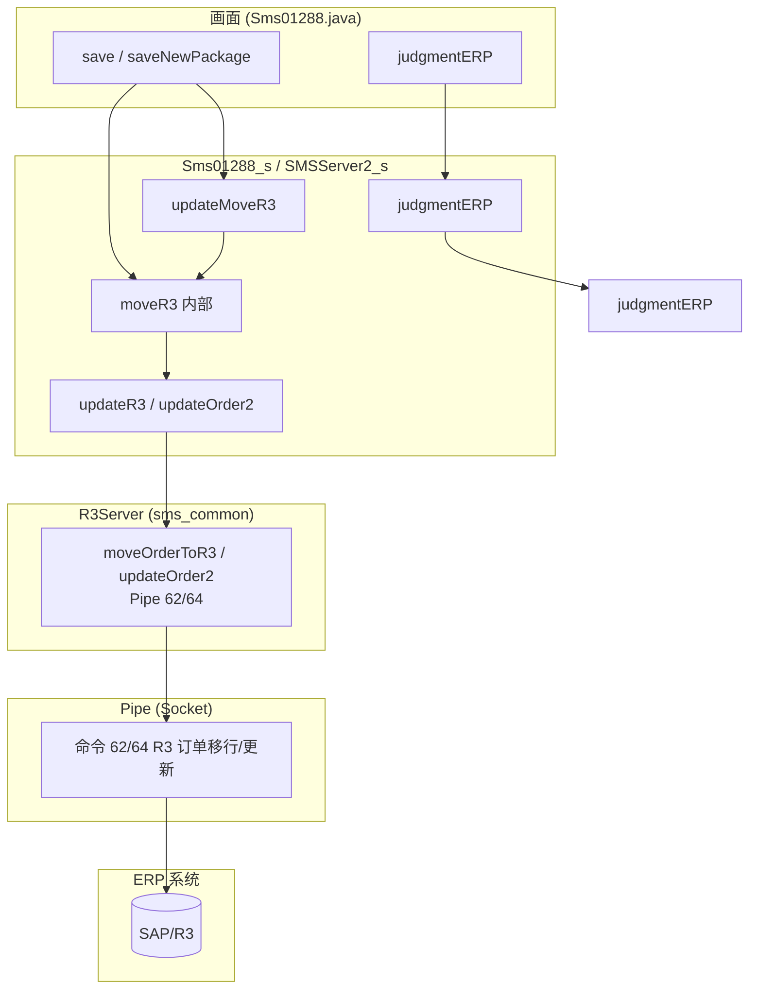
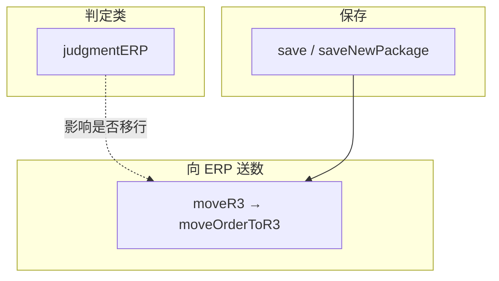

# Sms01288 与 ERP 交互接口依赖关系图

本文档对 RMI_SERVER 的 **Sms01288** 服务进行与 Sms012C3 相同的分析：与 ERP 交互的接口、依赖关系、ERP 不可用时的业务影响、前端 Mock 与 Pipe 另一端 Mock 的可行性及风险。

**服务与接口**：`Sms01288_i`（接口）、`Sms01288_s`（实现）、画面 `Sms01288.java`。底层通过 `SMSServerIfc`（SMSServer2）的 getMaster / moveOrderToR3 / updateOrder2 / judgmentERP 与 ERP 通信。**Sms01288_s 未直接使用 Pipe 类**，无 setFactoryResults 等 Pipe 63 调用。

---

## 一、整体架构：画面 → API → 服务器 → R3Server/Pipe → ERP

说明：Sms01288 的主数据类（getUnitPrice、getProducts、getCustomers、getConsigns 等）在实现中使用的是 **SMSMasterServer.PRICE、PRODUCT_LIST_1、CUSTOMER_LIST_1、CUSTOMER_CONSIGN、CUSTOMER_PRODUCT** 等类型，**未显式设置 FLAG "ERP"**。是否从 ERP 取数取决于共通 SMSServer 对这些类型的实现；若共通层对 PRICE/PRODUCT 等也走 ERP，则 getUnitPrice、getProducts 等会间接依赖 ERP。

---

## 二、Sms01288 与 ERP 交互的 API 一览与依赖摘要

### 1. 明确与 ERP 交互的接口（2 类）

| API / 流程 | 方向 | Pipe/类型 | 依赖关系简述 |
|------------|------|-----------|--------------|
| **judgmentERP** | 判定 | 间接（产品主数据） | 调用 remoteObject_.judgmentERP，依赖产品主数据，影响是否走 R3 移行。 |
| **save / saveNewPackage 等内部触发的 R3 移行** | 送数 | 62/64 | 内部调用 moveR3 → remoteObject_.moveOrderToR3 或 updateOrder2，将订单数据同步到 ERP。 |

说明：Sms01288_i 未定义独立的 moveR3(Hashtable) 接口，R3 移行由 **save、saveNewPackage、updateMoveR3** 等流程内部调用 moveR3(String[], ...) 再调用 remoteObject_.moveOrderToR3 完成。

### 2. 可能间接依赖 ERP 的主数据接口（取决于 SMSServer）

若共通 SMSServer 对下列类型使用 ERP/Pipe 取数，则以下接口会间接依赖 ERP：

| API | 使用的 TYPE / 说明 |
|-----|---------------------|
| getUnitPrice | SMSMasterServer.PRICE（未设 FLAG "ERP"） |
| isUnitPriceMaster | SMSMasterServer.PRICE |
| getProducts | PRODUCT_LIST_1 |
| getProducts2 | PRODUCT_LIST_2 |
| getCustomerProducts | CUSTOMER_PRODUCT |
| getCustomers | CUSTOMER_LIST_1 |
| getConsigns | CUSTOMER_CONSIGN |
| getProductName | PRODUCT |

Sms01288_s 中**未使用**：Pipe 类、setFactoryResults、getMaster 的 FLAG "ERP"、CUSTOMER_LIST_ERP、PRICE_LIST_ERP、PRODUCT_LIST_ERP 等。因此与 Sms012C3/Sms01206 相比，**明确**依赖 ERP 的接口较少，主要为 **judgmentERP** 与 **R3 移行（经 save 等触发的 moveR3）**。

---

## 三、业务调用顺序依赖

---

## 四、若所有依赖 ERP 的接口均无法与 ERP 交互时，Sms01288 无法完成的业务

当 **judgmentERP** 与 **R3 移行（moveOrderToR3/updateOrder2）** 无法与 ERP 正常交互时，以下业务会受影响。

### 1. 完全无法完成的业务（送数类）

| 业务 | 依赖的 ERP 接口 | 无法完成的含义 |
|------|-----------------|----------------|
| **R/3 订单移行・更新** | save/saveNewPackage 等内部调用的 moveR3 → moveOrderToR3 / updateOrder2（Pipe 62/64） | 订单无法从 SMS 同步到 ERP，或 R3 侧无法更新。 |

### 2. 判定・后续流程受影响

| 业务 | 依赖的 ERP 接口 | 无法完成的含义 |
|------|-----------------|----------------|
| **ERP 连携机种判定** | judgmentERP | 无法正确判定该机种是否与 ERP 连携，导致该移行 R3 的未移行、或不该移行的被误判为移行。 |

### 3. 可能受影响的主数据（若 SMSServer 对 PRICE/PRODUCT 等走 ERP）

若共通层对 PRICE、PRODUCT 等类型从 ERP 取数，则 getUnitPrice、getProducts、getCustomerProducts 等无法取得来自 ERP 的最新数据，画面下拉/价格带出会受影响。

### 4. 仍可完成的业务

- **getEntryNo、getDetail、getEntryDatas、getLabelString** 等不依赖 ERP 的检索与画面初始化。
- **save** 在仅写 SMS 库、不执行 R3 移行或移行被跳过时，SMS 侧数据仍可保存；但 R3 移行不会成功。

### 5. 汇总表：按影响程度

| 影响程度 | 业务 | 说明 |
|----------|------|------|
| **完全不可** | R/3 订单移行・更新 | 经 save 等触发的 moveR3/moveOrderToR3 无法写入 ERP。 |
| **逻辑异常** | ERP 连携机种判定 | judgmentERP 不可用，移行前提条件错误。 |
| **可能受限** | 主数据（价格・机种・得意先等） | 若 SMSServer 对 PRICE/PRODUCT 等走 ERP，则受影响。 |
| **可完成** | SMS 内检索、画面操作、仅 SMS 保存 | 与 ERP 未同步。 |

---

## 五、Sms01288 主要业务入口 API

业务必须以这些 API 为入口，没有它们正确返回/执行，其它 API 无法独立完成业务：

| 序号 | API | 业务角色 |
|------|-----|----------|
| 1 | getLabelString | 画面初始化 |
| 2 | getEntryNo | 採番，新规时取得 entry_no |
| 3 | getDetail / getEntryDatas | 检索・加载数据，无则无法更新/保存正确上下文 |
| 4 | save | 保存（含可能触发的 R3 移行） |
| 5 | saveNewPackage | 新规同梱保存（含可能触发的 R3 移行） |

以上为 Sms01288 的主要业务入口；**judgmentERP** 与 **R3 移行**（经 save 等触发）为依赖 ERP 的判定与送数，不替代上述入口。

---

## 六、与 Sms012C3 / Sms01206 的差异摘要

| 项目 | Sms012C3 / Sms01206 | Sms01288 |
|------|---------------------|----------|
| **Pipe 直接使用** | setFactoryResults 使用 Pipe 63 | 无，未使用 Pipe 类 |
| **getMaster 显式 FLAG "ERP"** | getPrice、getUnitPrice、getProducts 等有 | 无，主数据用 PRICE、PRODUCT_LIST_1、CUSTOMER_LIST_1 等 |
| **与 ERP 交互的接口数量** | 13 个 / 8 个 | **明确 2 类**（judgmentERP + R3 移行）；主数据类视 SMSServer 而定 |
| **moveR3 暴露方式** | 接口 moveR3(Hashtable) | 内部 moveR3(String[],...)，由 save/updateMoveR3 等触发 |
