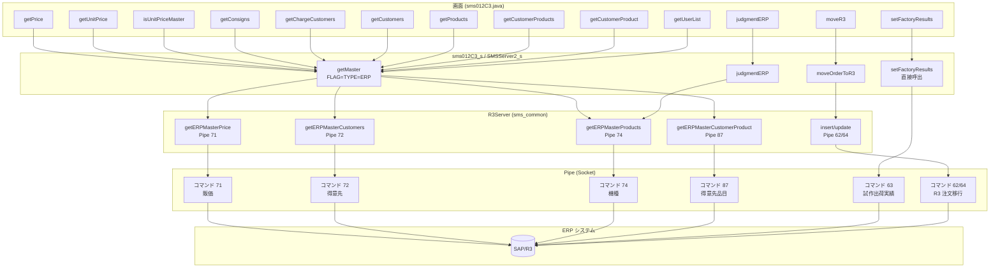
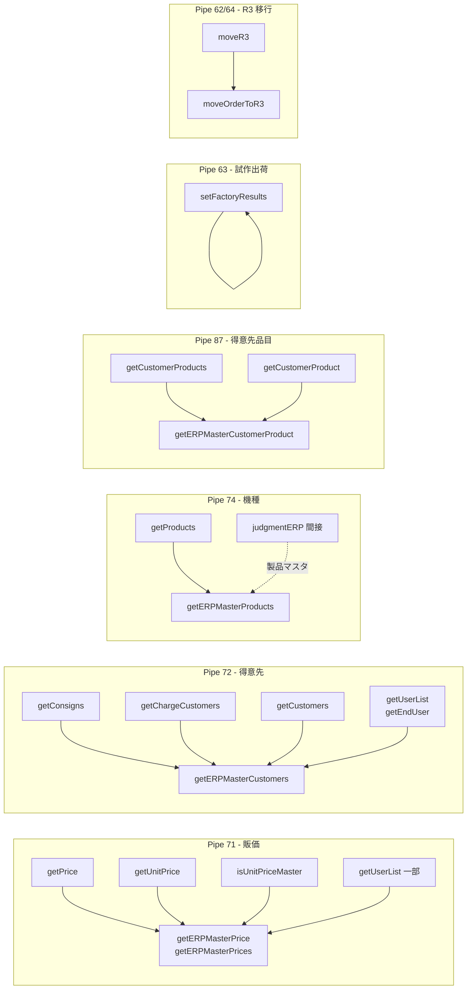
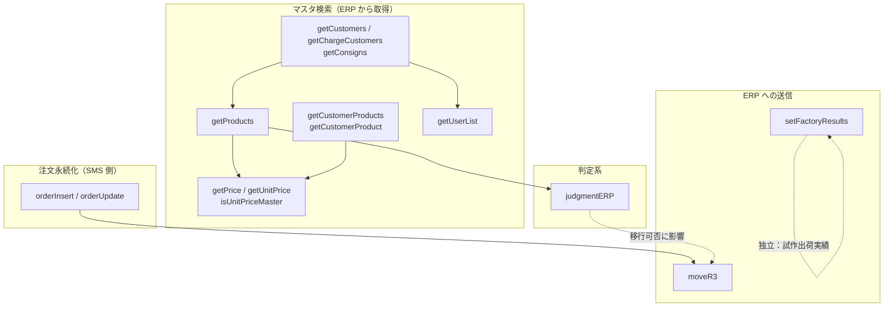

# Sms012C3 と ERP 連携インターフェース依赖関係図

## 一、全体アーキテクチャ：画面 → API → サーバ → Pipe → ERP

## 二、Pipe コマンド / データタイプ別 API グループ依赖

## 三、業務呼び出し順序依赖（前後関係）

## 四、ERP と連携する 13 API 一覧と依赖概要

| API | 方向 | Pipe/タイプ | 依赖関係の概要 |
|-----|------|-------------|----------------|
| getPrice | 取得 | 71 販価 | getMaster(ERP PRICE) に依存。他 API と独立 |
| getUnitPrice | 取得 | 71 販価 | 同上 |
| isUnitPriceMaster | 取得 | 71 販価 | 同上 |
| getConsigns | 取得 | 72 得意先 | getMaster(CUSTOMER_LIST_ERP) に依存。独立 |
| getChargeCustomers | 取得 | 72 得意先 | 同上 |
| getCustomers | 取得 | 72 得意先 | 同上 |
| getProducts | 取得 | 74 機種 | getMaster(PRODUCT_LIST_ERP/ERP PRODUCT) に依存。独立 |
| getCustomerProducts | 取得 | 87 得意先品目 | getMaster(CUSTOMER_PRODUCT_ERP2) に依存。独立 |
| getCustomerProduct | 取得 | 87 得意先品目 | getMaster(CUSTOMER_PRODUCT_ERP) に依存。独立 |
| getUserList | 取得 | 71 + 72 | PRICE_LIST_ERP + getEndUser(CUSTOMER_LIST_ERP) |
| setFactoryResults | 送信 | 63 | 直接 Pipe。他 ERP API に非依存 |
| moveR3 | 送信 | 62/64 | **orderInsert/orderUpdate の先行実行に依存**。業務上は注文保存後に呼び出し |
| judgmentERP | 判定 | 間接 74 | 製品マスタ（getProducts/PRICE 由来の可能性）に依存。moveR3 実行可否に影響 |

説明：
- **取得系** 10 個：相互に呼び出し順序の制約はなく、いずれも「必要に応じて ERP からマスタを取得」。
- **送信系** 2 個：**moveR3** は注文の保存済み（orderInsert/orderUpdate）に依存；**setFactoryResults** は独立。
- **判定系** 1 個：**judgmentERP** は製品マスタ（74 機種データ関連）に依存し、後続の moveR3 実行可否に影響する。

---

## 五、ERP に依存するインターフェースがすべて ERP と連携できない場合に、Sms012C3 で完了できない業務

上記 13 個の ERP 連携インターフェースが**すべて ERP システムと正常に連携できない**場合、以下の業務に影響するか、完了できない。

### 1. 完全に完了できない業務（送信系）

| 業務 | 依存する ERP インターフェース | 完了できない意味 |
|------|-------------------------------|------------------|
| **R/3 注文移行** | moveR3（Pipe 62/64） | 注文を SMS から ERP（SAP/R3）に同期できない。保存後の注文は R3 側で生成/更新されず、生産・出荷・在庫等の ERP 側プロセスは当該注文に基づいて進行できない。 |
| **無償試作出荷実績登録** | setFactoryResults（Pipe 63） | 試作出荷実績を ERP に書き戻せない。試作出荷業務は ERP 側で正しい実績データを得られない。 |

### 2. マスタ・検索系：「ERP 由来の最新データ」を取得できない

| 業務 | 依存する ERP インターフェース | 完了できない意味 |
|------|-------------------------------|------------------|
| **得意先・担当・配送先の ERP 元データ** | getCustomers, getChargeCustomers, getConsigns（Pipe 72） | ERP から最新の得意先/担当/配送先マスタを取得できない。画面のドロップダウンが空になるか、ローカル/キャッシュのみとなり、ERP と一致した選択・チェックが保証できない。 |
| **機種一覧の ERP 元データ** | getProducts（Pipe 74） | ERP から最新の機種マスタを取得できない。機種選択/検索が空またはローカルデータのみとなり、新規・変更時の機種選択に影響する。 |
| **販価・標準販価の ERP 元データ** | getPrice, getUnitPrice, isUnitPriceMaster（Pipe 71） | ERP から販価を取得できず、「機種・得意先別」販価存在チェックができない。価格の自動带出、標準販価制限等のロジックが ERP に沿って正しく実行できない。 |
| **得意先品目・NSCM 品目** | getCustomerProducts, getCustomerProduct（Pipe 87） | ERP から得意先品目/NSCM 品目を取得できない。機種・得意先ダイアログ検索、NSCM 品目带出等を ERP データに基づいて完了できない。 |
| **NSCM 最終ユーザ一覧** | getUserList（Pipe 71 + 72） | ERP から最終ユーザ一覧を取得できず、NSCM 画面上の「最終ユーザ」選択を正しく完了できない。 |

### 3. 判定・後続フローへの影響（判定系）

| 業務 | 依存する ERP インターフェース | 完了できない意味 |
|------|-------------------------------|------------------|
| **ERP 連携機種判定** | judgmentERP（74 等に間接依存） | 「当該機種が ERP と連携するか」を正しく判定できない。erpProduct_/erpFlag_ 等のフラグ異常により、R3 に移行すべき注文が移行されない、または移行すべきでないものが移行対象と誤判定され、R3 移行の前提条件が誤る。 |

### 4. 引き続き完了できる業務（上記 ERP インターフェースに非依存）

「ERP との連携がすべて無効」という前提では、以下は完了可能（SMS 自身の DB と主要 API に依存）：

- **注文の新規・更新・削除・枝番追加**（getEntryNo, getOrderSub, getOrder, orderInsert, orderUpdate, orderDelete）  
  → 注文は **SMS 側**で正常に保存・保守できる。
- **画面初期化とラベル表示**（getLabelString）。
- **ERP マスタに依存しないドロップダウン/検索**（SMS またはローカルマスタのみ使用する場合）。

つまり：**SMS 内の「受注入力・保守」は完了できるが、「ERP と一致したマスタ取得」「R3 移行」「試作出荷実績の書き戻し」は完了できない。**

### 5. 影響度別まとめ表

| 影響度 | 業務 | 説明 |
|--------|------|------|
| **完全に不可** | R/3 注文移行 | 注文データを ERP に書き込めない。 |
| **完全に不可** | 無償試作出荷実績登録 | 試作実績を ERP に書き戻せない。 |
| **著しく制限** | 得意先・担当・配送先・機種・販価・得意先品目・NSCM ユーザ等のマスタ | ERP 由来の最新データを取得できず、入力・チェックが ERP と不一致。 |
| **ロジック異常** | ERP 連携機種判定 → 移行判断 | R3 移行の可否の前提条件が誤る。 |
| **完了可能** | SMS 内注文の増削改査、画面操作 | SMS 側データに限り、ERP と未同期。 |
