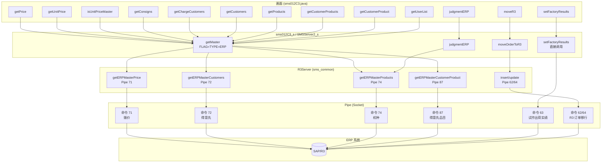
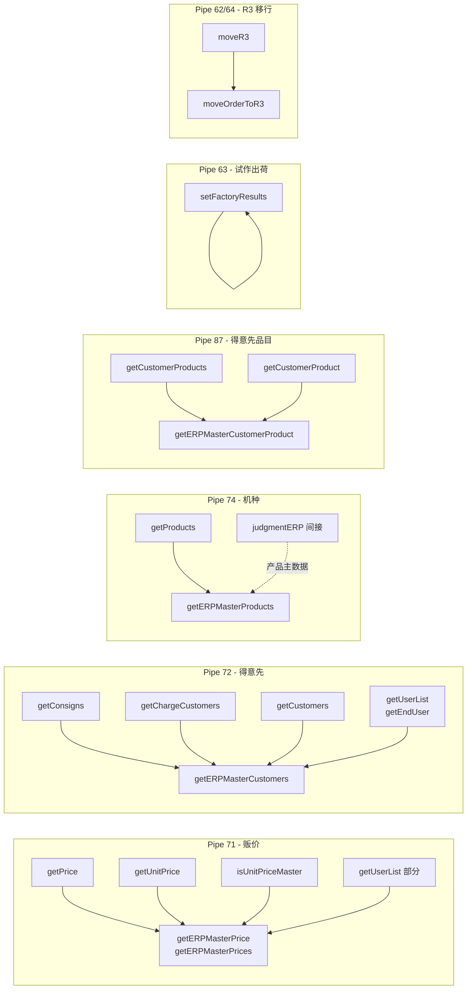
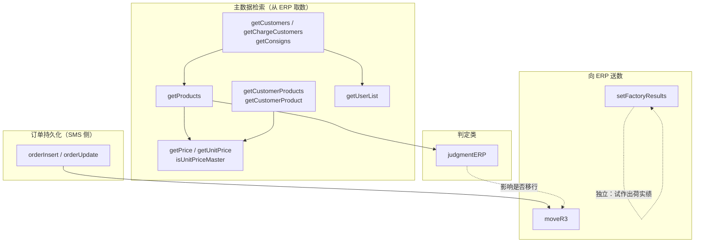

# Sms012C3 与 ERP 交互接口依赖关系图

## 一、整体架构：画面 → API → 服务器 → Pipe → ERP

## 二、按 Pipe 命令 / 数据类型的 API 分组依赖

## 三、业务调用顺序依赖（谁先谁后）

## 四、13 个与 ERP 交互的 API 一览与依赖摘要

| API | 方向 | Pipe/类型 | 依赖关系简述 |
|-----|------|-----------|--------------|
| getPrice | 取数 | 71 贩价 | 依赖 getMaster(ERP PRICE)，独立于其他 API |
| getUnitPrice | 取数 | 71 贩价 | 同上 |
| isUnitPriceMaster | 取数 | 71 贩价 | 同上 |
| getConsigns | 取数 | 72 得意先 | 依赖 getMaster(CUSTOMER_LIST_ERP)，独立 |
| getChargeCustomers | 取数 | 72 得意先 | 同上 |
| getCustomers | 取数 | 72 得意先 | 同上 |
| getProducts | 取数 | 74 机种 | 依赖 getMaster(PRODUCT_LIST_ERP/ERP PRODUCT)，独立 |
| getCustomerProducts | 取数 | 87 得意先品目 | 依赖 getMaster(CUSTOMER_PRODUCT_ERP2)，独立 |
| getCustomerProduct | 取数 | 87 得意先品目 | 依赖 getMaster(CUSTOMER_PRODUCT_ERP)，独立 |
| getUserList | 取数 | 71 + 72 | PRICE_LIST_ERP + getEndUser(CUSTOMER_LIST_ERP) |
| setFactoryResults | 送数 | 63 | 直接 Pipe，不依赖其他 ERP API |
| moveR3 | 送数 | 62/64 | **依赖** orderInsert/orderUpdate 先执行，业务上在订单保存后调用 |
| judgmentERP | 判定 | 间接 74 | 依赖产品主数据（可能来自 getProducts/PRICE），影响是否走 moveR3 |

说明：
- **取数类** 10 个：彼此无强制调用顺序，都是“按需从 ERP 取主数据”。
- **送数类** 2 个：**moveR3** 依赖订单已保存（orderInsert/orderUpdate）；**setFactoryResults** 独立。
- **判定类** 1 个：**judgmentERP** 依赖产品主数据（与 74 机种数据相关），并影响后续是否执行 moveR3。

---

## 五、若所有依赖 ERP 的接口均无法与 ERP 交互时，Sms012C3 无法完成的业务

当上述 13 个与 ERP 交互的接口**全部无法正常与 ERP 系统交互**时，以下业务会受影响或无法完成。

### 1. 完全无法完成的业务（送数类）

| 业务 | 依赖的 ERP 接口 | 无法完成的含义 |
|------|-----------------|----------------|
| **R/3 订单移行** | moveR3（Pipe 62/64） | 订单无法从 SMS 同步到 ERP（SAP/R3）。保存后的订单不会在 R3 侧生成/更新，生产・出荷・在库等 ERP 侧流程无法基于该订单进行。 |
| **无偿试作出荷实绩登録** | setFactoryResults（Pipe 63） | 试作出荷实绩无法回写到 ERP。试作出荷业务在 ERP 侧无法得到正确实绩数据。 |

### 2. 主数据・检索类：无法取得“来自 ERP 的最新数据”

| 业务 | 依赖的 ERP 接口 | 无法完成的含义 |
|------|-----------------|----------------|
| **得意先・担当・配送先的 ERP 源数据** | getCustomers, getChargeCustomers, getConsigns（Pipe 72） | 无法从 ERP 取得最新得意先/担当/配送先主数据。画面下拉可能为空或仅剩本地/缓存数据，无法保证与 ERP 一致的选择与校验。 |
| **机种一覧的 ERP 源数据** | getProducts（Pipe 74） | 无法从 ERP 取得最新机种主数据。机种选择/检索可能为空或仅本地数据，新规・变更时选机种会受影响。 |
| **贩价・标准贩价的 ERP 源数据** | getPrice, getUnitPrice, isUnitPriceMaster（Pipe 71） | 无法从 ERP 取得贩价、无法做“机种・得意先别”贩价存在检查。价格无法自动带出、标准贩价限制等逻辑无法按 ERP 正确执行。 |
| **得意先品目・NSCM 品目** | getCustomerProducts, getCustomerProduct（Pipe 87） | 无法从 ERP 取得得意先品目/NSCM 品目。机种・得意先对话框检索、NSCM 品目带出等无法基于 ERP 数据完成。 |
| **NSCM 最终用户列表** | getUserList（Pipe 71 + 72） | 无法从 ERP 取得最终用户列表，NSCM 画面上的“最终用户”选择无法正确完成。 |

### 3. 判定・后续流程受影响（判定类）

| 业务 | 依赖的 ERP 接口 | 无法完成的含义 |
|------|-----------------|----------------|
| **ERP 连携机种判定** | judgmentERP（间接依赖 74 等） | 无法正确判定“该机种是否与 ERP 连携”。erpProduct_/erpFlag_ 等标志异常，导致：该移行 R3 的订单可能不移行、或不该移行的被误判为移行，R3 移行前提条件错误。 |

### 4. 仍可完成的业务（不依赖上述 ERP 接口）

在「与 ERP 的交互全部失效」的前提下，以下仍可完成（依赖 SMS 自身 DB 与主要 API）：

- **订单的新规・更新・删除・枝番追加**（getEntryNo, getOrderSub, getOrder, orderInsert, orderUpdate, orderDelete）  
  → 订单在 **SMS 侧** 可正常保存与维护。
- **画面初始化与标签显示**（getLabelString）。
- **不依赖 ERP 主数据的下拉/检索**（仅用 SMS 或本地主数据时）。

即：**SMS 内的“受注录入・维护”可以做完，但“与 ERP 一致的主数据取得”“R3 移行”“试作出荷实绩回写”均无法完成。**

### 5. 汇总表：按影响程度

| 影响程度 | 业务 | 说明 |
|----------|------|------|
| **完全不可** | R/3 订单移行 | 订单数据无法写入 ERP。 |
| **完全不可** | 无偿试作出荷实绩登録 | 试作实绩无法回写 ERP。 |
| **严重受限** | 得意先・担当・配送先・机种・贩价・得意先品目・NSCM 用户等主数据 | 无法取得来自 ERP 的最新数据，输入・校验与 ERP 不一致。 |
| **逻辑异常** | ERP 连携机种判定 → 移行判断 | 是否移行 R3 的前提条件错误。 |
| **可完成** | SMS 内订单的增删改查、画面操作 | 仅限 SMS 侧数据，与 ERP 未同步。 |

